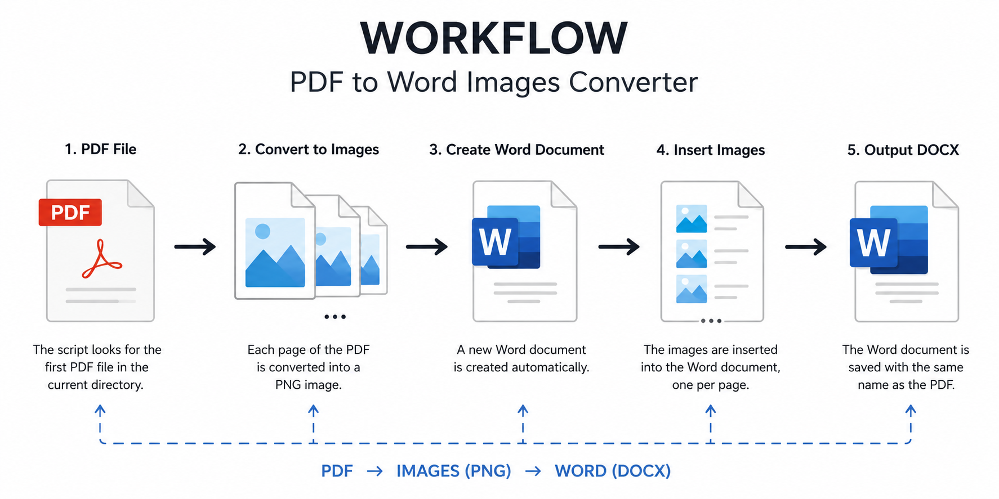

\# PDF to Word Images Converter


\## Overview


This project automatically converts a PDF document into a Microsoft Word document by transforming each PDF page into an image and inserting those images into a Word file.


The script is designed to work with any PDF placed in the same directory as the script, requiring no manual configuration of file paths.


\## Features


\* Automatically detects the first PDF file in the working directory.

\* Converts every PDF page into a high-resolution PNG image.

\* Creates a Word document automatically.

\* Inserts one page image per Word page.

\* Preserves the original appearance of the PDF pages.

\* Automatically adjusts image size to fit the document page.

\* Uses the original PDF filename for the generated Word document.


\## Project Structure


```text

project-folder/

│

├── converter.py

├── document.pdf

│

├── document.docx

│

└── imagenes\_temporales/


## Workflow




\## Requirements


\* Python 3.9+

\* PyMuPDF

\* python-docx

\* Pillow


\## Installation


Install the required packages:


```bash

pip install pymupdf python-docx pillow

```


\## Usage


Place the PDF file in the same folder as the script:


```text

converter.py

my\_document.pdf

```


Run the script:


```bash

python converter.py

```


The generated Word document will appear in the same folder:


```text

my\_document.docx

```


\## How It Works


1\. The script searches for the first PDF file in the current directory.

2\. Each PDF page is converted into a PNG image.

3\. A new Word document is created.

4\. The images are inserted into the document, one per page.

5\. The Word document is saved using the same name as the original PDF.


\## Example Workflow


```text

PDF File

&#x20;   ↓

Convert Pages to Images

&#x20;   ↓

Create Word Document

&#x20;   ↓

Insert Images

&#x20;   ↓

Generate DOCX

```


\## Technologies Used


\* Python

\* PyMuPDF

\* python-docx

\* Pillow


\## License


This project is available for educational and personal use.


